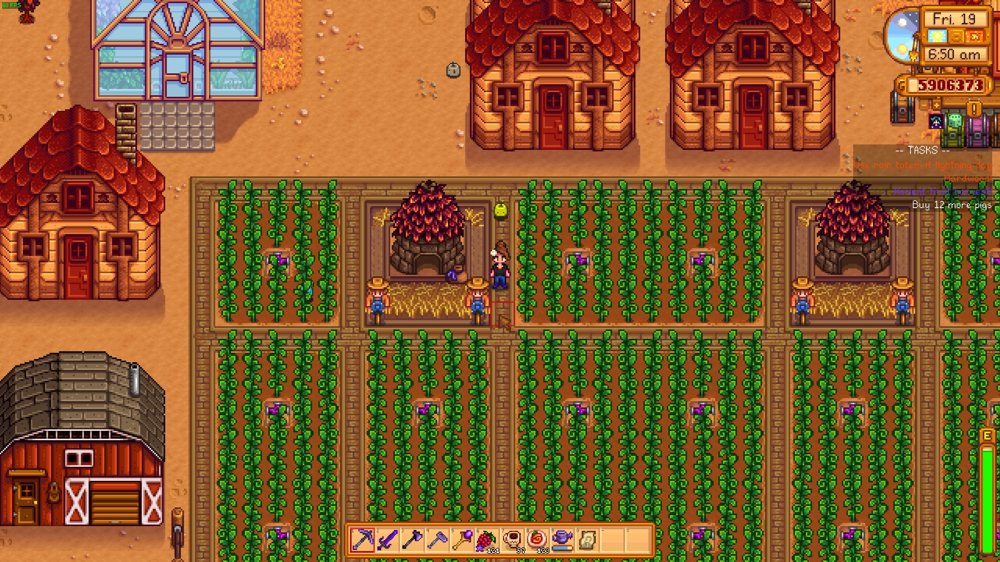

# SchedulePlanner
A Stardew Valley mod utilizing SMAPI to allow users to plan their days by adding tasks to the calendar.

## HOW TO USE ##
1. Open the calendar (next to the bulletin board in town, or purchaseable from Robin).
    * If you have CalendarAnywhere option set in the config, you can use the CalendarHotkey to open the calendar.
2. Click on any day - you can navigate to different years and seasons using the arrows at the top.
3. A new menu (I call it the Agenda or the task list) should pop up asking which type of task you want to create - daily, weekly, or nonrecurrent. Select which one you'd like, then type your task into the editbox and press enter.
4. Tasks for the current day are displayed underneath the clock & wallet.

If you have many tasks for a single day then you can use the arrows next to the task list to navigate to other pages.

You can edit existing tasks by left clicking its task entry in the task list.

You can delete existing tasks by right clicking its task entry in the task list. There is no confirmation prompt, and all changes are saved immediately.

Multiplayer is supported but untested. A full sync of tasks should occur when a new player connects and at the start of each day. New tasks, edited tasks, and deleted tasks should sync as they occur. There's skeleton code for a permissions system to combat potential griefing, but it's unfinished.

## HOW TO INSTALL ##
*A more complete guide can be found on the stardew valley wiki here: https://stardewvalleywiki.com/Modding:Player_Guide/Getting_Started*
1. Install SMAPI (https://smapi.io/)
2. Unzip SchedulePlanner*.zip into the Mods folder in your Stardew Valley game directory

## SCREENSHOTS ##

